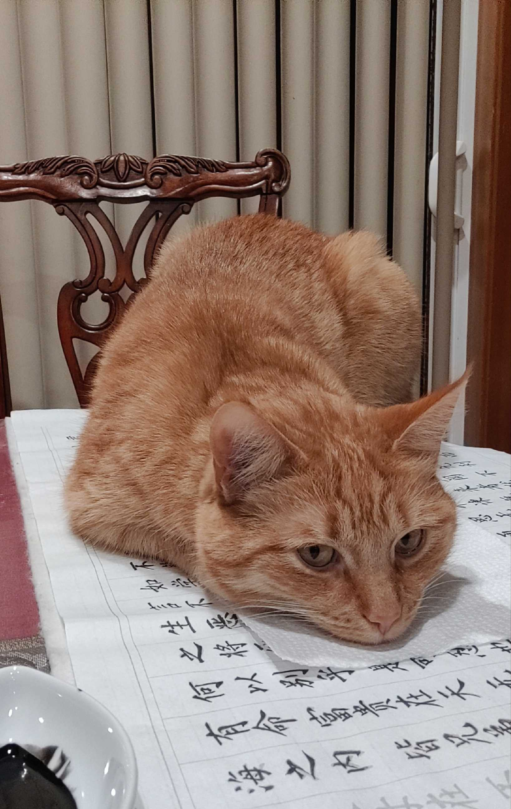

# Hello!

I'm Allen Zheng! Welcome to my portfolio! 

## About me
I am a Full Stack Developer based in Seattle whos always looking to build something fun.

  

- Interested in games and sports
- I love going biking and skiing
- I swam competitively for 12 years
- I hope to travel more. I've been to China, Canada, Korea, and Japan

This is my cat Pumpkin!

  

### Contact Me at:
- LinkedIn: [zhengallen1505](https://www.linkedin.com/in/zhengallen1505/)
- Email: allenz1505@gmail.com

### Education

- University of Washington (Informatics and Nutrition)

## Resume
[Click here to view my resume](https://raw.githubusercontent.com/allenzheng15/allenzheng15/main/Resume%20Allen%20Zheng%202027.pdf)

## Projects

### Current Project (TFT Assistant)

TFT assistant which will help players analyze their game state and offer suggestions on their next move to lead them to victory. 

### 2D Automated Car

Designed and developed a custom 2D simulation environment for an autonomous car, incorporating obstacles, goal-based navigation, and dynamic interactions. Applied a reinforcement learning agent using Deep Q-Network (DQN), optimizing the agent's training with epsilon decay and advanced hyperparameter tuning to improve decision-making performance. Used TensorFlow to design and train neural networks, achieving stable learning and performance improvements, with model checkpoints and evaluation metrics.

### Peony Identification App

Custom-trained a Sequential model to identify peonies specifically compared to other flowers. Collected, cleaned, and labeled thousands of photos of flowers from databases and web browsers for training. Designed and developed a website for image capture and classification with OpenCV and Flask backend for image processing and machine learning algorithm classification.

### Annotation Masking Tool

Utilizing Facebook's SAM2 model I created a masking tool which would highlight entire select areas which would subsequently be used to train future camera tracking algorithms. 

## Skills

**Languages:** TypeScript, Java, Python, SQLite, R, HTML

**Frameworks:** Jupyter Notebook

**Developer Tools:** AWS, Git, VSCode, Anaconda, Google Colab

**Libraries:** Pandas, Tensorflow, Matplotlib, NumPy, Pytorch

